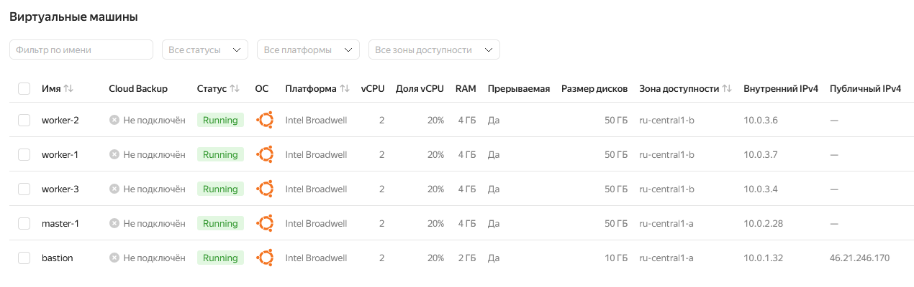

# Дипломный практикум в Yandex.Cloud
* [Цели:](#цели)
  * [Этапы выполнения:](#этапы-выполнения)
     * [Создание облачной инфраструктуры](#создание-облачной-инфраструктуры)
     * [Создание Kubernetes кластера](#создание-kubernetes-кластера)
     * [Создание тестового приложения](#создание-тестового-приложения)
     * [Подготовка cистемы мониторинга и деплой приложения](#подготовка-cистемы-мониторинга-и-деплой-приложения)
     * [Установка и настройка CI/CD](#установка-и-настройка-cicd)
  * [Что необходимо для сдачи задания?](#что-необходимо-для-сдачи-задания)
  * [Как правильно задавать вопросы дипломному руководителю?](#как-правильно-задавать-вопросы-дипломному-руководителю)

---
## Цели:

1. Подготовить облачную инфраструктуру на базе облачного провайдера Яндекс.Облако.
2. Запустить и сконфигурировать Kubernetes кластер.
3. Установить и настроить систему мониторинга.
4. Настроить и автоматизировать сборку тестового приложения с использованием Docker-контейнеров.
5. Настроить CI для автоматической сборки и тестирования.
6. Настроить CD для автоматического развёртывания приложения.

---
## Этапы выполнения:


### Создание облачной инфраструктуры

Для начала необходимо подготовить облачную инфраструктуру в ЯО при помощи [Terraform](https://www.terraform.io/).

Особенности выполнения:

- Бюджет купона ограничен, что следует иметь в виду при проектировании инфраструктуры и использовании ресурсов;
Для облачного k8s используйте региональный мастер(неотказоустойчивый). Для self-hosted k8s минимизируйте ресурсы ВМ и долю ЦПУ. В обоих вариантах используйте прерываемые ВМ для worker nodes.

Предварительная подготовка к установке и запуску Kubernetes кластера.

1. Создайте сервисный аккаунт, который будет в дальнейшем использоваться Terraform для работы с инфраструктурой с необходимыми и достаточными правами. Не стоит использовать права суперпользователя

>Создаем сервисный аккаунт для дальнейшего использования Terraform для работы с инфраструктурой [sa.tf](./terraform/src/infra/sa.tf)

>Создаем S3-бакет, в котором будем хранить стейт файл terraform.tfstate [s3-backend.tf](./terraform/src/infra/s3-backend.tf)


>Добавляем в переменные окружения идентификатор ключа и секретный ключ, сохраненные ранее в файл backend.tfvars. Для этого выполняем следующие команды:

```
export ACCESS_KEY="<идентификатор_ключа>"
export SECRET_KEY="<секретный_ключ>"
```

2. Подготовьте [backend](https://developer.hashicorp.com/terraform/language/backend) для Terraform:  
   а. Рекомендуемый вариант: S3 bucket в созданном ЯО аккаунте(создание бакета через TF)
   б. Альтернативный вариант:  [Terraform Cloud](https://app.terraform.io/)
3. Создайте конфигурацию Terrafrom, используя созданный бакет ранее как бекенд для хранения стейт файла. Конфигурации Terraform для создания сервисного аккаунта и бакета и основной инфраструктуры следует сохранить в разных папках.

>Добавим в конфигурационный файл [providers.tf](./terraform/src/k8s/providers.tf) настройки бэкенда:

```
backend "s3" {
   endpoints = {
      s3 = "https://storage.yandexcloud.net"
   }
   bucket = "s3-tf-backend"
   region = "ru-central1-a"
   key    = "diploma/terraform.tfstate"

   skip_region_validation      = true
   skip_credentials_validation = true
   skip_requesting_account_id  = true # Необходимая опция Terraform для версии 1.6.1 и старше.
   skip_s3_checksum            = true # Необходимая опция при описании бэкенда для Terraform версии 1.6.3 и старше.
}
```

>Применим изменения и посмотрим на результат:

```
terraform init -backend-config="access_key=$ACCESS_KEY" -backend-config="secret_key=$SECRET_KEY"
```


4. Создайте VPC с подсетями в разных зонах доступности.

>Код для создания VPC с подсетями в разных зонах доступности [vpc.tf](./terraform/src/k8s/vpc.tf)

5. Убедитесь, что теперь вы можете выполнить команды `terraform destroy` и `terraform apply` без дополнительных ручных действий.
6. В случае использования [Terraform Cloud](https://app.terraform.io/) в качестве [backend](https://developer.hashicorp.com/terraform/language/backend) убедитесь, что применение изменений успешно проходит, используя web-интерфейс Terraform cloud.

Ожидаемые результаты:

1. Terraform сконфигурирован и создание инфраструктуры посредством Terraform возможно без дополнительных ручных действий, стейт основной конфигурации сохраняется в бакете или Terraform Cloud
2. Полученная конфигурация инфраструктуры является предварительной, поэтому в ходе дальнейшего выполнения задания возможны изменения.

---
### Создание Kubernetes кластера

На этом этапе необходимо создать [Kubernetes](https://kubernetes.io/ru/docs/concepts/overview/what-is-kubernetes/) кластер на базе предварительно созданной инфраструктуры.   Требуется обеспечить доступ к ресурсам из Интернета.

Это можно сделать двумя способами:

1. Рекомендуемый вариант: самостоятельная установка Kubernetes кластера.  
   а. При помощи Terraform подготовить как минимум 3 виртуальных машины Compute Cloud для создания Kubernetes-кластера. Тип виртуальной машины следует выбрать самостоятельно с учётом требовании к производительности и стоимости. Если в дальнейшем поймете, что необходимо сменить тип инстанса, используйте Terraform для внесения изменений.  
   б. Подготовить [ansible](https://www.ansible.com/) конфигурации, можно воспользоваться, например [Kubespray](https://kubernetes.io/docs/setup/production-environment/tools/kubespray/)  
   в. Задеплоить Kubernetes на подготовленные ранее инстансы, в случае нехватки каких-либо ресурсов вы всегда можете создать их при помощи Terraform.
2. Альтернативный вариант: воспользуйтесь сервисом [Yandex Managed Service for Kubernetes](https://cloud.yandex.ru/services/managed-kubernetes)  
  а. С помощью terraform resource для [kubernetes](https://registry.terraform.io/providers/yandex-cloud/yandex/latest/docs/resources/kubernetes_cluster) создать **региональный** мастер kubernetes с размещением нод в разных 3 подсетях      
  б. С помощью terraform resource для [kubernetes node group](https://registry.terraform.io/providers/yandex-cloud/yandex/latest/docs/resources/kubernetes_node_group)

  >Выбираю вариант самостоятельной установки Kubernetes кластера. Для этого подготавливаю 5 ВМ: бастион-хост для подключения к кластеру, один мастер и три воркер-ноды. Мастер и воркер-ноды размещаю в разных подсетях. [bastion.tf](./terraform/src/k8s/bastion.tf), [master.tf](./terraform/src/k8s/master.tf), [worker.tf](./terraform/src/k8s/worker.tf)
  
  >Для последующего развертывания кластера при помощи Kubespray необходимо подготовить инвентори-файл [hosts.yaml](./terraform/ansible/hosts.yaml), который получается в результате выполнения кода из [ansible.tf](./terraform/src/k8s/ansible.tf) и [hosts.tftpl](./terraform/src/k8s/hosts.tftpl) и далее копируется на мастер-ноду при помощи provisioner

  ```
  # --- Копирование hosts.yaml ---
  provisioner "file" {
    source      = "../../ansible/hosts.yaml"
    destination = "/home/ubuntu/hosts.yaml"
  }
  
  # --- Установка git, python3-pip, python3.12-venv ---
  provisioner "remote-exec" {
    inline = [
      "sudo apt update",
      "sudo apt install -y git python3-pip python3.12-venv",
      "echo 'Git, Python и venv установлены'"
    ]
  }

  # --- Клонирование Kubespray и установка зависимостей ---
  provisioner "remote-exec" {
    inline = [
      "cd /home/${var.vm_user}",
      "git clone -b release-2.26 https://github.com/kubernetes-incubator/kubespray.git", 
      "echo 'Kubespray успешно склонирован'",
      "cd kubespray/",
      "python3 -m venv venv",
      "source venv/bin/activate",
      "pip install -r requirements.txt",
      "echo 'Ansible и зависимости Kubespray установлены'"
    ]
  }
  ```

  
  

  >После развёртывания облачной инфраструктуры, приступаю к развёртыванию Kubernetes кластера. Разворачивать буду из репозитория Kubespray со своей локальной машины.
  >Запуск плейбука для установки идет на хосте бастиона. Сначала прокидываем в него ssh ключ - это нужно для корректной работы скриптов установки ansible. После установки этот ключ необходимо удалить!

  ```
  scp /home/dervish/.ssh/id_ed25519 ubuntu@46.21.246.170:.ssh/id_ed25519
  ```
  >Далее в папке со скачаным ранее репозиторием kubespray создаем и активируем виртуальное окружение и устанавливаем необходимые для работы зависимости

  ```
  cd kubespray/
  python3 -m venv venv
  source venv/bin/activate
  python3 -m pip install -r requirements.txt
  ```
  >Теперь все готово для установки кластера, запускаем плейбук

  ```
  ansible-playbook -i ~/hosts.yaml cluster.yml -b -v
  ```

  

  >После успешной установки подключаемся к мастер-ноде и проверяем работоспособность кластера

  ```
  ssh -i ~/.ssh/id_ed25519 -J ubuntu@46.21.246.170 ubuntu@10.0.2.28
  ```

Ожидаемый результат:

1. Работоспособный Kubernetes кластер.
2. В файле `~/.kube/config` находятся данные для доступа к кластеру.
3. Команда `kubectl get pods --all-namespaces` отрабатывает без ошибок.


---
### Создание тестового приложения

Для перехода к следующему этапу необходимо подготовить тестовое приложение, эмулирующее основное приложение разрабатываемое вашей компанией.

Способ подготовки:

1. Рекомендуемый вариант:  
   а. Создайте отдельный git репозиторий с простым nginx конфигом, который будет отдавать статические данные.  
   б. Подготовьте Dockerfile для создания образа приложения.  
2. Альтернативный вариант:  
   а. Используйте любой другой код, главное, чтобы был самостоятельно создан Dockerfile.

Ожидаемый результат:

1. Git репозиторий с тестовым приложением и Dockerfile.
2. Регистри с собранным docker image. В качестве регистри может быть DockerHub или [Yandex Container Registry](https://cloud.yandex.ru/services/container-registry), созданный также с помощью terraform.

>Тестовое приложение представляет из себя простой статичный одностраничник. Все запаковано в контейнер docker. Образ пушится в Yandex Container Registry, который в свою очередь создается при помощи Terraform. Сам репозиторий доступен по ссылке [simple-site](https://github.com/ua4wne/simple-site.git)


---
### Подготовка cистемы мониторинга и деплой приложения

Уже должны быть готовы конфигурации для автоматического создания облачной инфраструктуры и поднятия Kubernetes кластера.  
Теперь необходимо подготовить конфигурационные файлы для настройки нашего Kubernetes кластера.

Цель:
1. Задеплоить в кластер [prometheus](https://prometheus.io/), [grafana](https://grafana.com/), [alertmanager](https://github.com/prometheus/alertmanager), [экспортер](https://github.com/prometheus/node_exporter) основных метрик Kubernetes.
2. Задеплоить тестовое приложение, например, [nginx](https://www.nginx.com/) сервер отдающий статическую страницу.

Способ выполнения:
1. Воспользоваться пакетом [kube-prometheus](https://github.com/prometheus-operator/kube-prometheus), который уже включает в себя [Kubernetes оператор](https://operatorhub.io/) для [grafana](https://grafana.com/), [prometheus](https://prometheus.io/), [alertmanager](https://github.com/prometheus/alertmanager) и [node_exporter](https://github.com/prometheus/node_exporter). Альтернативный вариант - использовать набор helm чартов от [bitnami](https://github.com/bitnami/charts/tree/main/bitnami).

### Деплой инфраструктуры в terraform pipeline

1. Если на первом этапе вы не воспользовались [Terraform Cloud](https://app.terraform.io/), то задеплойте и настройте в кластере [atlantis](https://www.runatlantis.io/) для отслеживания изменений инфраструктуры. Альтернативный вариант 3 задания: вместо Terraform Cloud или atlantis настройте на автоматический запуск и применение конфигурации terraform из вашего git-репозитория в выбранной вами CI-CD системе при любом комите в main ветку. Предоставьте скриншоты работы пайплайна из CI/CD системы.

Ожидаемый результат:
1. Git репозиторий с конфигурационными файлами для настройки Kubernetes.
2. Http доступ на 80 порту к web интерфейсу grafana.
3. Дашборды в grafana отображающие состояние Kubernetes кластера.
4. Http доступ на 80 порту к тестовому приложению.
5. Atlantis или terraform cloud или ci/cd-terraform

